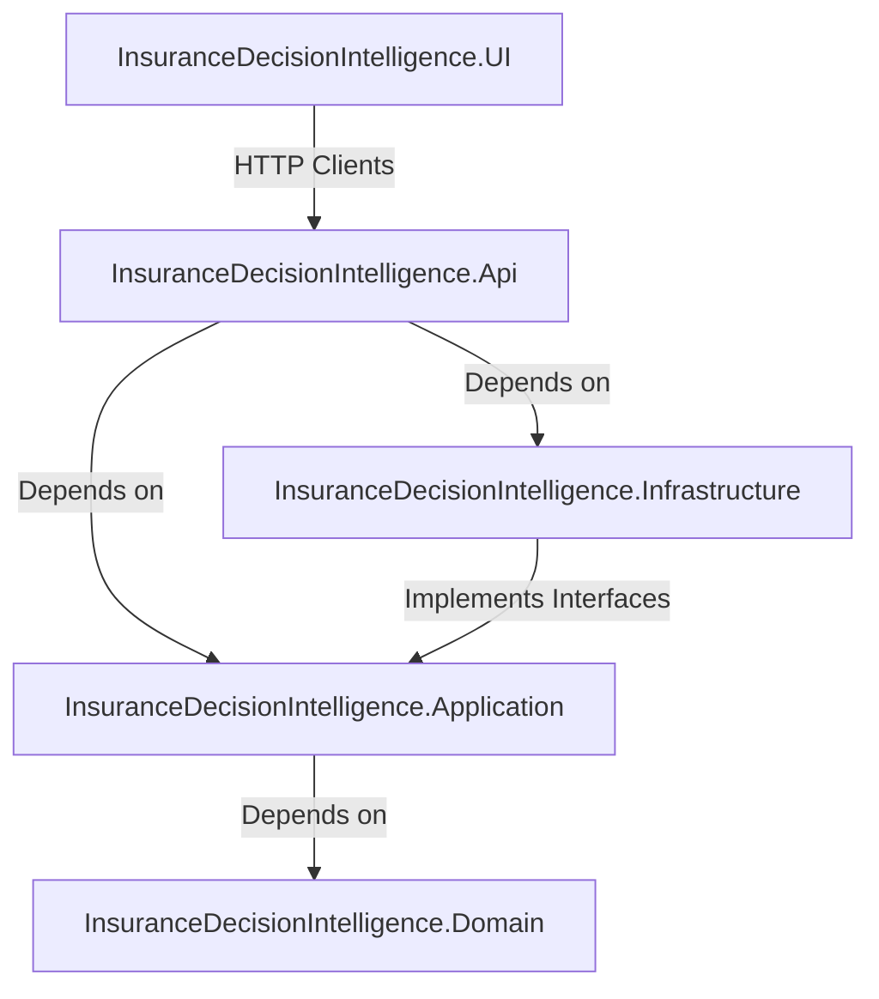
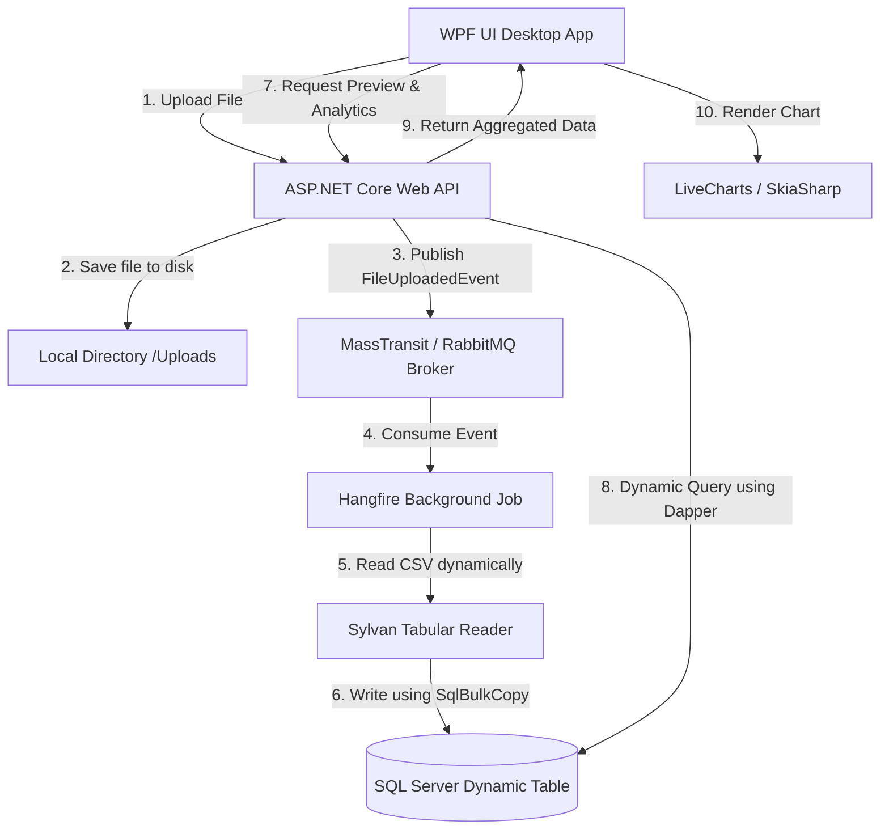

# Insurance Decision Intelligence System
A high-performance, enterprise-grade **Insurance Risk & Pricing Intelligence System** built on **Clean Architecture** principles. The system allows insurance analysts to upload large datasets (CSV/Excel), dynamically import them into a SQL database using optimized bulk copy mechanisms, process them asynchronously using background workers, and visualize analytical charts in a modern desktop dashboard.
---
## 🏗️ Architecture Overview
The project is structured according to **Clean Architecture (Onion Architecture)** principles to ensure strict separation of concerns, testability, and independence from external frameworks.

### Project Layers
1. **[Domain](InsuranceDecisionIntelligence.Domain/)**: Contains the enterprise business objects, entity models, and core enumerations. It has zero external dependencies.
2. **[Application](InsuranceDecisionIntelligence.Application/)**: Defines the interfaces, DTOs, use cases, event contracts, and domain services. It coordinates business activities and has no dependency on the Database or Web frameworks.
3. **[Infrastructure](InsuranceDecisionIntelligence.Infrastructure/)**: Houses database access implementations (Dapper, SQL Bulk Copy), file parsing services (Sylvan CSV, ExcelDataReader), event-driven queues (RabbitMQ), and persistent job processors (Hangfire).
4. **[Api](InsuranceDecisionIntelligence.Api/)**: The ASP.NET Core Web API serving as the entry point for frontend clients, hosting Swagger documentation, and controlling middleware.
5. **[UI](InsuranceDecisionIntelligence.UI/)**: A modern desktop WPF client featuring Material Design styles, pagination controls, and interactive data visualization charts.
---

## 🔄 Data Flow Pipeline
The diagram below details the pipeline workflow from file selection to dynamic chart visualization:

---

## ⚡ Key Technical Features & Patterns
* **Clean Architecture & Dependency Inversion:** Clear separation between business rules and infrastructural details.
* **Event-Driven Architecture (EDA):** Leverages **MassTransit** over **RabbitMQ** to publish file upload events (`FileUploadedEvent`), decoupling the upload action from the heavy ingestion phase.
* **Asynchronous Background Processing:** Employs **Hangfire** for scheduling and executing ingestion tasks in background threads, providing retry logic and job monitoring.
* **Dynamic Schema-on-Read Database Import:** Creates SQL tables dynamically based on CSV/Excel file headers (utilizing timestamped unique table names) and maps values dynamically using `NVARCHAR(500)`.
* **High-Performance Bulk Copy:** Uses ADO.NET **`SqlBulkCopy`** coupled with **`Sylvan.Data.Csv`** (the fastest CSV reader in .NET) for memory-efficient streaming and inserting of millions of rows in seconds.
* **Keyset Pagination & Fast Counting:** Employs Dapper for raw SQL execution. Queries counts instantly via SQL Server partitions `sys.partitions` ($O(1)$) and pages data using clustered key indexing (`TableId`) instead of slow offset-fetch.
* **Dynamic Data Aggregation:** Aggregates and filters columns dynamically on the SQL server (supporting `SUM`, `AVG`, `COUNT`, `MIN`, `MAX`) for analytical reports.
* **Rich Data Visualization:** A WPF frontend styled with **Material Design** and integrated with **LiveChartsCore / SkiaSharp** to render charts (Bar, Line, Pie) directly from dynamic SQL queries.
---
## 🛠️ Technology Stack
* **Runtime:** .NET 9.0 (C#)
* **API Framework:** ASP.NET Core Web API (Kestrel, Swagger OpenAPI)
* **Desktop Framework:** WPF (Windows Presentation Foundation)
* **Database Access:** Microsoft.Data.SqlClient (ADO.NET), Dapper (Micro-ORM)
* **Message Broker:** MassTransit with RabbitMQ
* **Job Queue:** Hangfire (SQL Server storage)
* **Tabular File Parsing:** Sylvan.Data.Csv, ExcelDataReader, ClosedXML, EPPlus
* **Theming & Design:** MaterialDesignInXamlToolkit
* **Charting:** LiveChartsCore.SkiaSharpView
---
## 🚀 Getting Started
### Prerequisites
* [.NET 9.0 SDK](https://dotnet.microsoft.com/download/dotnet/9.0)
* [Microsoft SQL Server](https://www.microsoft.com/en-us/sql-server/sql-server-downloads) (Express or Developer Edition)
* [RabbitMQ Server](https://www.rabbitmq.com/) (running on localhost default port `5672`)
### 1. Database Setup
Ensure SQL Server is running, and create the databases as specified in the connection strings:
* `InsuranceDB` (Main application data and dynamic tables)
* `HangfireInsuranceDB` (Background jobs management)
### 2. Configuration
Update the connection strings and file storage settings in `InsuranceDecisionIntelligence.Api/appsettings.json`:
```json
{
  "ConnectionStrings": {
    "DefaultConnection": "Server=127.0.0.1,1433;Database=InsuranceDB;Trusted_Connection=True;TrustServerCertificate=True;",
    "HangfireConnection": "Server=127.0.0.1,1433;Database=HangfireInsuranceDB;Trusted_Connection=True;TrustServerCertificate=True;"
  },
  "FileStorageSettings": {
    "ServerType": "Local",
    "FolderPath": "C:\\Uploads\\"
  }
}
```
### 3. Running the Application
Start both the Backend API and the UI Desktop Client:
#### Run the Web API:
```bash
cd InsuranceDecisionIntelligence.Api
dotnet run
```
Once started, you can access the API Swagger dashboard at `https://localhost:7039/swagger/index.html`.
#### Run the WPF Desktop Client:
```bash
cd ../InsuranceDecisionIntelligence.UI
dotnet run
```
---
## 📡 API Reference
|
 Endpoint 
|
 Method 
|
 Description 
|
|
:---
|
:---
|
:---
|
|
`/api/File/upload`
|
`POST`
|
 Uploads a CSV/Excel file, saves it, and publishes the import event. 
|
|
`/api/File/files`
|
`GET`
|
 Retrieves summaries of all successfully imported files. 
|
|
`/api/File/preview`
|
`GET`
|
 Retrieves paginated records from an imported table (using file ID, page, and size). 
|


