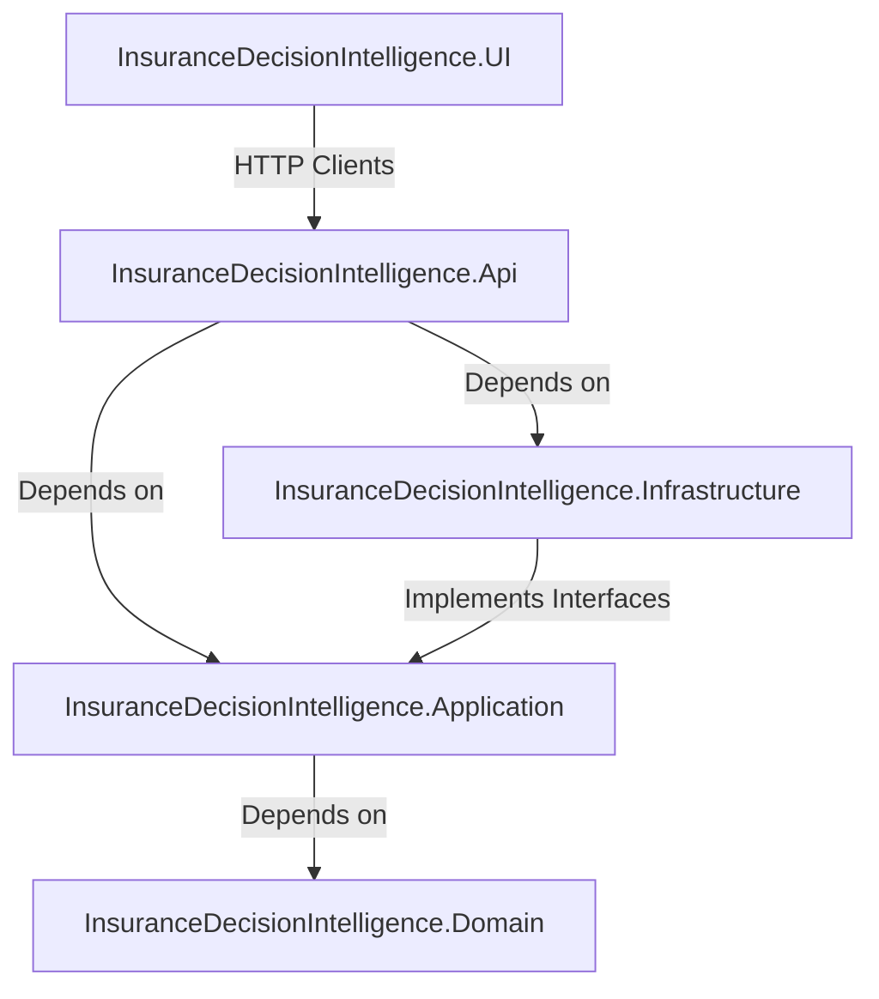
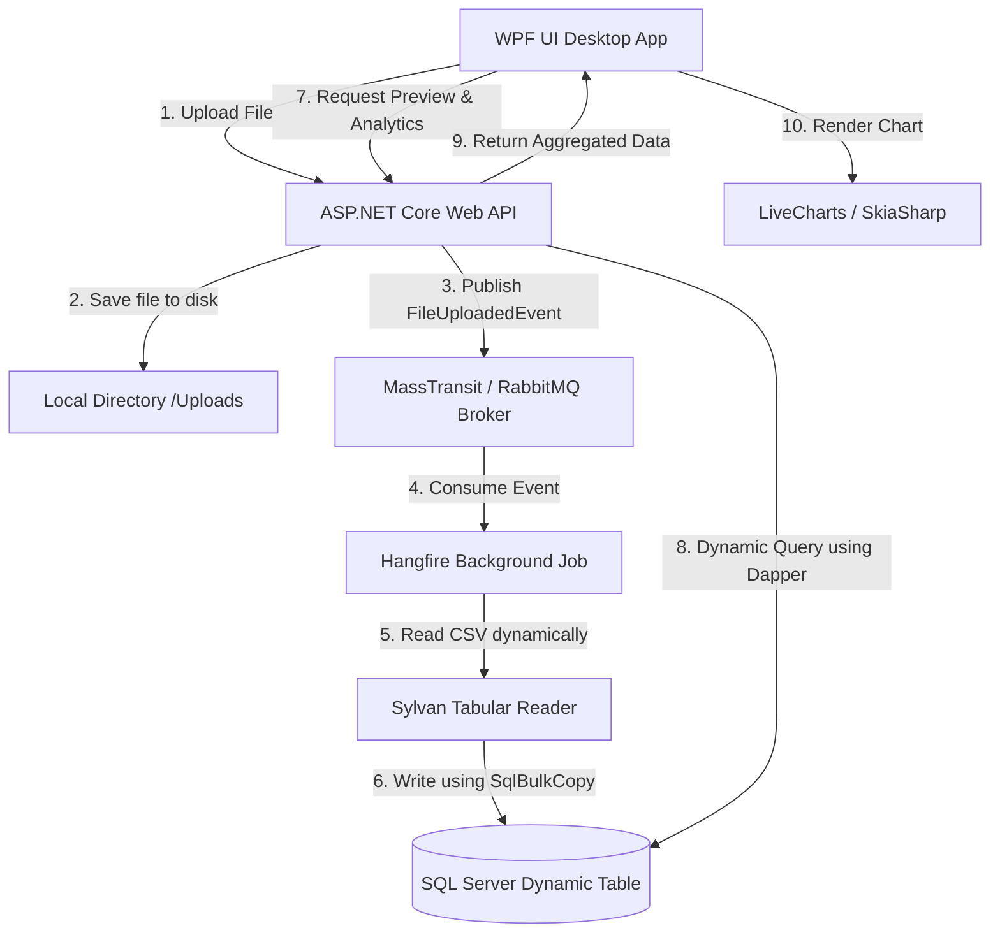
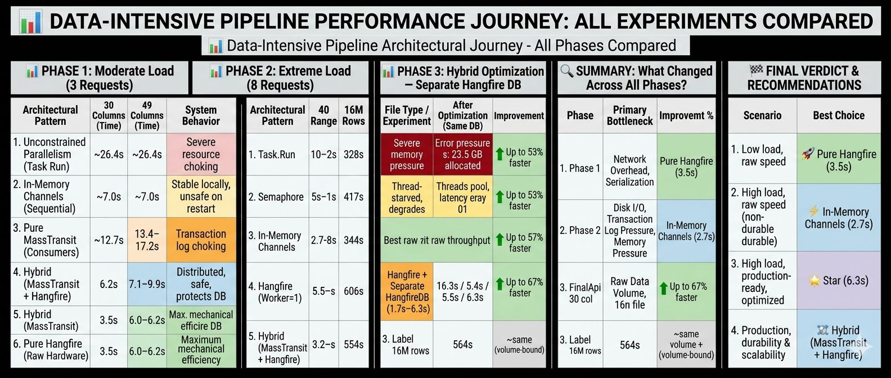
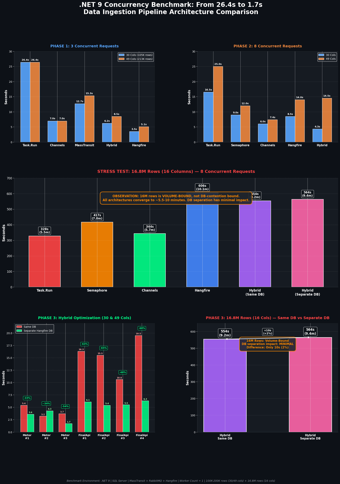
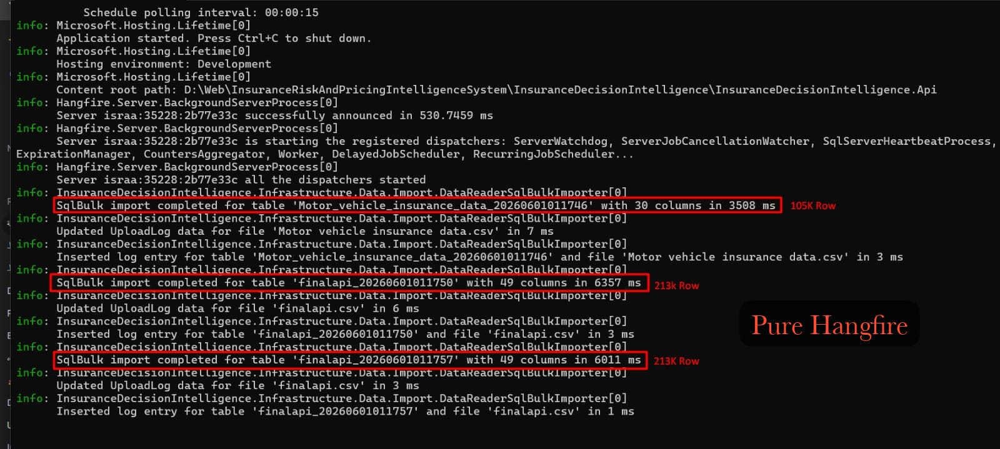
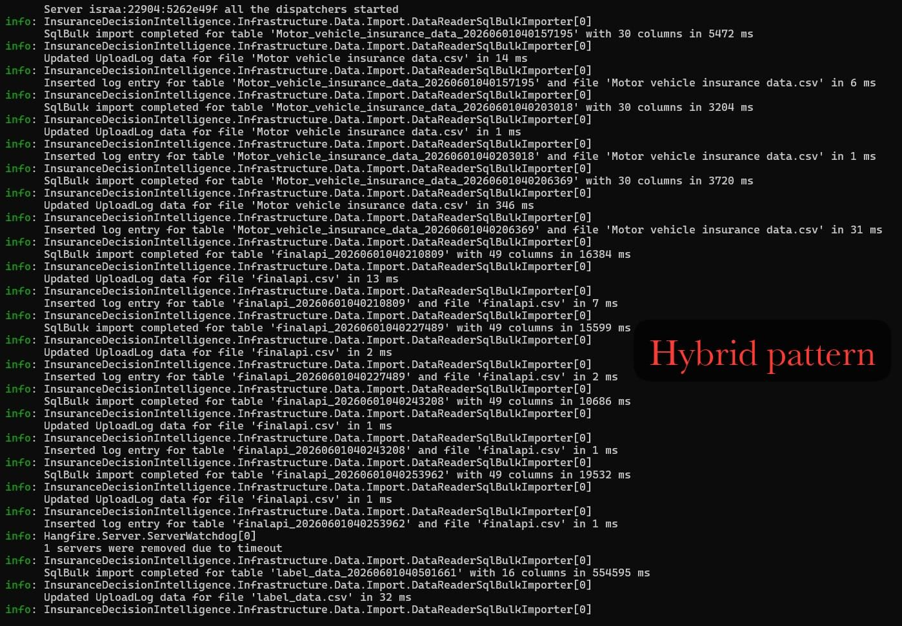
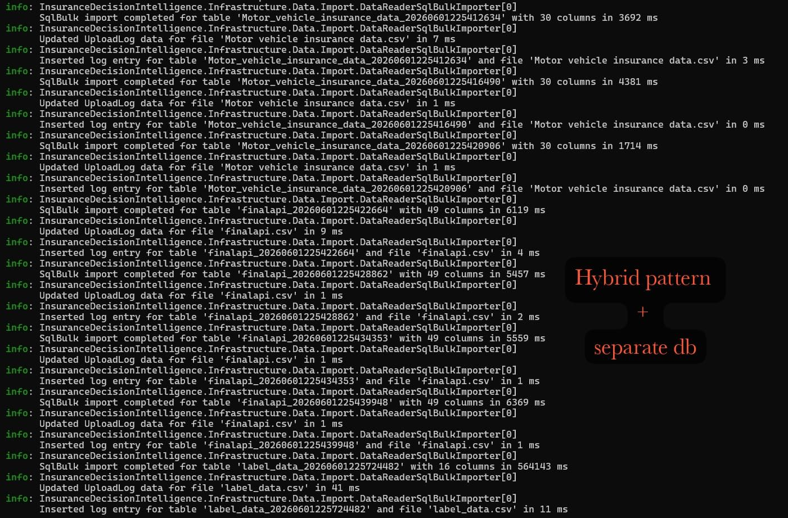

# Insurance Decision Intelligence System

A high-performance, enterprise-grade **Insurance Risk & Pricing Intelligence System** built on **Clean Architecture** principles. The system allows insurance analysts to upload large datasets (CSV/Excel), dynamically import them into a SQL database using optimized bulk copy mechanisms, process them asynchronously using background workers, and visualize analytical charts in a modern desktop dashboard.

---

## 🏗️ Architecture Overview

The project is structured according to **Clean Architecture (Onion Architecture)** principles to ensure strict separation of concerns, testability, and independence from external frameworks.



### Project Layers

1. **[Domain](InsuranceDecisionIntelligence.Domain/)**: Contains the enterprise business objects, entity models, and core enumerations. It has zero external dependencies.
2. **[Application](InsuranceDecisionIntelligence.Application/)**: Defines the interfaces, DTOs, use cases, event contracts, and domain services. It coordinates business activities and has no dependency on the Database or Web frameworks.
3. **[Infrastructure](InsuranceDecisionIntelligence.Infrastructure/)**: Houses database access implementations (Dapper, SQL Bulk Copy), file parsing services (Sylvan CSV, ExcelDataReader), event-driven queues (RabbitMQ), and persistent job processors (Hangfire).
4. **[Api](InsuranceDecisionIntelligence.Api/)**: The ASP.NET Core Web API serving as the entry point for frontend clients, hosting Swagger documentation, and controlling middleware.
5. **[UI](InsuranceDecisionIntelligence.UI/)**: A modern desktop WPF client featuring Material Design styles, pagination controls, and interactive data visualization charts.

---

## 🔄 Data Flow Pipeline

The diagram below details the pipeline workflow from file selection to dynamic chart visualization:



---

## ⚡ Key Technical Features & Patterns

* **Clean Architecture & Dependency Inversion:** Clear separation between business rules and infrastructural details.
* **Event-Driven Architecture (EDA):** Leverages **MassTransit** over **RabbitMQ** to publish file upload events (`FileUploadedEvent`), decoupling the upload action from the heavy ingestion phase.
* **Asynchronous Background Processing:** Employs **Hangfire** for scheduling and executing ingestion tasks in background threads, providing retry logic and job monitoring.
* **Dynamic Schema-on-Read Database Import:** Creates SQL tables dynamically based on CSV/Excel file headers (utilizing timestamped unique table names) and maps values dynamically using `NVARCHAR(500)`.
* **High-Performance Bulk Copy:** Uses ADO.NET **`SqlBulkCopy`** coupled with **`Sylvan.Data.Csv`** (the fastest CSV reader in .NET) for memory-efficient streaming and inserting of millions of rows in seconds.
* **Keyset Pagination & Fast Counting:** Employs Dapper for raw SQL execution. Queries counts instantly via SQL Server partitions `sys.partitions` ($O(1)$) and pages data using clustered key indexing (`TableId`) instead of slow offset-fetch.
* **Dynamic Data Aggregation:** Aggregates and filters columns dynamically on the SQL server (supporting `SUM`, `AVG`, `COUNT`, `MIN`, `MAX`) for analytical reports.
* **Rich Data Visualization:** A WPF frontend styled with **Material Design** and integrated with **LiveChartsCore / SkiaSharp** to render charts (Bar, Line, Pie) directly from dynamic SQL queries.
---

## 📈 Performance & Concurrency Case Studies

Below is an overview of the performance journey and results of all experiments conducted on the pipeline:



Here are two detailed case studies documenting how the ingestion and query pipelines were optimized for massive scalability and high concurrency.

### 🚀 Case Study 1: Scaling a .NET & SQL Server Pipeline to 16.8M Rows

We optimized our high-throughput data processing engine to handle massive, wide-schema datasets. When processing 3 large-scale files simultaneously with over 35+ dynamic columns each, standard implementations face severe bottlenecks.

Here is how the pipeline was rebuilt for a **99.9% performance gain**.

#### 🎥 Performance & Ingestion Demo
Here is a video demonstration of the ingestion pipeline and query performance:

<video src="./assets/scaling_pipeline_demo.mp4" width="100%" controls></video>

#### 📌 Phase 1 — Initial Implementation
* **Architecture:** CSV ➔ `ExcelDataReader` ➔ `DataTable` ➔ SQL Server
* **Problems:**
  * ❌ Entire files loaded into memory
  * ❌ High memory allocations & GC pressure
  * ❌ Slow import performance
  * ❌ Heap tables without Clustered Indexes
  * ❌ Expensive `COUNT(*)` queries
  * ❌ Slow `OFFSET` pagination on large tables
* **Results:**
  * 🔹 105,555 rows / 30 columns ➔ **~35s**
  * 🔹 Fetching 1,000 rows from a 16.8M rows table ➔ **37,581ms**

#### 📌 Phase 2 — Import Pipeline Optimization
* **Changes:**
  * ✅ `IDataReader` instead of `DataTable`
  * ✅ `ExcelDataReader` ➔ `Sylvan.Data.Csv`
  * ✅ Streaming instead of full memory load
  * ✅ `SqlBulkCopy` with `TableLock`
  * ✅ `BatchSize` tuned to 50,000
* **Results:**
  * 🔹 105,555 rows ➔ **~5.3s**
  * 🔹 213,328 rows ➔ **~10.7s**
  * 🔹 16,811,621 rows ➔ **~10.3 min**
  * 🔹 Throughput ≈ **27,000 rows/sec**

#### 📌 Phase 3 — Query Optimization (Indexing)
* **Fix:** Added `PRIMARY KEY` (Clustered Index) to dynamic tables.
* **Impact:** First page query reduced from **~37s** to **~4s**.

#### 📌 Phase 4 — COUNT(*) Elimination
* **Fix:** Replaced expensive `COUNT(*)` with `sys.partitions` metadata.
* **Impact:** ⚡ **Instant row counts** (~0ms).

#### 📌 Phase 5 — Reducing Database Calls
* **Fix:** Used Dapper `QueryMultiple` to combine queries.
* **Impact:** ⚡ **Single round-trip** instead of multiple database calls.

#### 📌 Phase 6 — Pagination Optimization
* **Fix:** Replaced `OFFSET` with Keyset Pagination (Seek Method):
  ```sql
  WHERE Id > @LastId
  ```
* **Result:** Deep pages became as fast as the first page (**~31ms**).

#### 📊 Performance Comparison Summary

| Challenge | Before | After |
| :--- | :--- | :--- |
| **First Page Read** | 37,581 ms | **31 ms** |
| **Last Page Read** | 36,986 ms | **35 ms** *(via Seek Method)* |
| **Row Counting** | Several Seconds | **~0 ms** *(via Metadata)* |
| **Database Trips** | 2 Calls | **1 Call** *(via `QueryMultiple`)* |

#### 📊 Final Pipeline Architecture


> [!TIP]
> **Key Takeaway:** The real bottlenecks weren’t just database speed, but also memory allocation, data flow design, table structure, and query execution strategy. Fixing the full pipeline turned a slow system into a scalable, high-performance engine.

---

### 🚀 Case Study 2: From 26.4s to 1.7s: A Concurrency Journey in .NET 9

Building data-intensive ingestion pipelines (100K–200K rows, 49 columns) isn't about optimizing a single file — it's about what happens when multiple massive files hit your API at the exact same millisecond. 

Below are the results of 3 experiments conducted to find and eliminate the concurrency bottleneck.

#### 📊 Benchmarks & Visualization
Below are the visualization charts comparing the performance across different configurations:



#### 📌 Experiment Phases

##### Phase 1 — 3 Requests (Moderate Load)
* **Pure Hangfire:** 3.5s — fastest raw speed
* **Hybrid (MassTransit + Hangfire):** 6.2s — best speed + durability
* **In-Memory Channels:** 7.0s — fast but volatile
* 💡 **Bottleneck:** Network overhead & serialization

###### Phase 1 Logs (Pure Hangfire):


##### Phase 2 — 8 Requests (Extreme Load)
* **In-Memory Channels:** 2.7s — fastest raw throughput
* **Hybrid:** 5.4s — stable under burst
* **Hangfire:** 606s (10.1m) on 16.8M rows — slowest due to DB contention
* 💡 **Bottleneck Shifted To:** Disk I/O, transaction log pressure, memory pressure
* 📊 **Evidence:** GC Gen 0: 10,402 collections | Memory: 23,547 MB | Disk Queue Length spiked

###### Phase 2 Logs (Hybrid Pattern):


##### Phase 3 — The Fix (Separate Hangfire DB)
The Hybrid pattern wasn't slow because of the architecture — it was fighting `SqlBulkCopy` for the same SQL Server resources.
* **After Separation:**
  * Motor 30 col: **1.7s** (-54%)
  * FinalApi 49 col: **5.4s–6.3s** (was 10s–19s, -65%)
* **49-column files went from UNSTABLE to CONSISTENT.**
* *Note on 16.8M rows:* Same DB: 554s ➔ Separate DB: 564s. Only +10s (+2%). Why? 16M rows is **volume-bound**, not DB-contention bound.

###### Phase 3 Logs (Hybrid Pattern + Separate DB):


#### 🔍 Deep-Dive Analysis

##### Why Hangfire was slower than In-Memory Channels:
* **Channel:** Pure memory queue, zero persistence overhead.
* **Hangfire:** `INSERT` ➔ `UPDATE State` ➔ `Heartbeat` ➔ `Polling` ➔ `Counters` ➔ `Expiration` (all in SQL).
* *For 16M rows:* Channel (344s) vs Hangfire (606s) = **+76% slower**. This is the durability tax.

##### Why the Hybrid Pattern (MassTransit ➔ Hangfire) Wins in Production:
1. **Instant Response:** Consumer receives event ➔ schedules job in 2ms ➔ ACKs RabbitMQ ➔ returns `202 Accepted` to client.
2. **Reliability:** Worker executes `SqlBulkCopy` with retries + full Hangfire Dashboard visibility.
3. **Outcome:** ✅ API returns in ms | ✅ RabbitMQ freed instantly | ✅ Auto-retries | ✅ Independent scaling.

#### 🏆 Final Verdict (8 Requests, 49 Columns)
1. 🥇 **Hybrid + Separate DB:** **5.8s** — *Winner (Fast & Durable)*
2. 🥈 **In-Memory Channels:** **7.4s** — *Fast but volatile*
3. 🥉 **SemaphoreSlim:** **12.0s** — *Safe but slow*
4. 4️⃣ **Hangfire (same DB):** **14.0s** — *Contested*
5. 5️⃣ **Hybrid (same DB):** **14.5s** — *DB-taxed*
6. 6️⃣ **Task.Run:** **25.0s** — *Chaos*

> [!WARNING]
> **Key Takeaways & Lessons Learned:**
> 1. **Brokers are messengers, not factories:** ACK fast, process asynchronously.
> 2. **Every middleware layer has a tax:** Always measure it.
> 3. **Beware database contention:** Separate DBs (e.g. Hangfire storage vs Application storage) when possible.
> 4. **Never inject Scoped DbContext into Singleton services.**
> 5. **Fastest ≠ most scalable:** Channels are extremely fast but lose all queued data on application restart.
> 6. **The bottleneck changes with load:**
>    * *Low load:* Eliminate overhead.
>    * *High load:* Control resource contention.
>    * *Solved contention:* Optimize data volume throughput.

---

## 🛠️ Technology Stack

* **Runtime:** .NET 9.0 (C#)
* **API Framework:** ASP.NET Core Web API (Kestrel, Swagger OpenAPI)
* **Desktop Framework:** WPF (Windows Presentation Foundation)
* **Database Access:** Microsoft.Data.SqlClient (ADO.NET), Dapper (Micro-ORM)
* **Message Broker:** MassTransit with RabbitMQ
* **Job Queue:** Hangfire (SQL Server storage)
* **Tabular File Parsing:** Sylvan.Data.Csv, ExcelDataReader, ClosedXML, EPPlus
* **Theming & Design:** MaterialDesignInXamlToolkit
* **Charting:** LiveChartsCore.SkiaSharpView

---

## 🚀 Getting Started

### Prerequisites
* [.NET 9.0 SDK](https://dotnet.microsoft.com/download/dotnet/9.0)
* [Microsoft SQL Server](https://www.microsoft.com/en-us/sql-server/sql-server-downloads) (Express or Developer Edition)
* [RabbitMQ Server](https://www.rabbitmq.com/) (running on localhost default port `5672`)

### 1. Database Setup
Ensure SQL Server is running, and create the databases as specified in the connection strings:
* `InsuranceDB` (Main application data and dynamic tables)
* `HangfireInsuranceDB` (Background jobs management)

### 2. Configuration
Update the connection strings and file storage settings in `InsuranceDecisionIntelligence.Api/appsettings.json`:
```json
{
  "ConnectionStrings": {
    "DefaultConnection": "Server=127.0.0.1,1433;Database=InsuranceDB;Trusted_Connection=True;TrustServerCertificate=True;",
    "HangfireConnection": "Server=127.0.0.1,1433;Database=HangfireInsuranceDB;Trusted_Connection=True;TrustServerCertificate=True;"
  },
  "FileStorageSettings": {
    "ServerType": "Local",
    "FolderPath": "C:\\Uploads\\"
  }
}
```

### 3. Running the Application
Start both the Backend API and the UI Desktop Client:

#### Run the Web API:
```bash
cd InsuranceDecisionIntelligence.Api
dotnet run
```
Once started, you can access the API Swagger dashboard at `https://localhost:7039/swagger/index.html`.

#### Run the WPF Desktop Client:
```bash
cd ../InsuranceDecisionIntelligence.UI
dotnet run
```

---

## 📡 API Reference

| Endpoint | Method | Description |
| :--- | :--- | :--- |
| `/api/File/upload` | `POST` | Uploads a CSV/Excel file, saves it, and publishes the import event. |
| `/api/File/files` | `GET` | Retrieves summaries of all successfully imported files. |
| `/api/File/preview` | `GET` | Retrieves paginated records from an imported table (using file ID, page, and size). |
| `/api/File/analyze/metadata` | `POST` | Generates aggregated analytical chart data dynamically based on request parameters. |
| `/api/File/jobs` | `GET` | Returns list of background job queues. |
